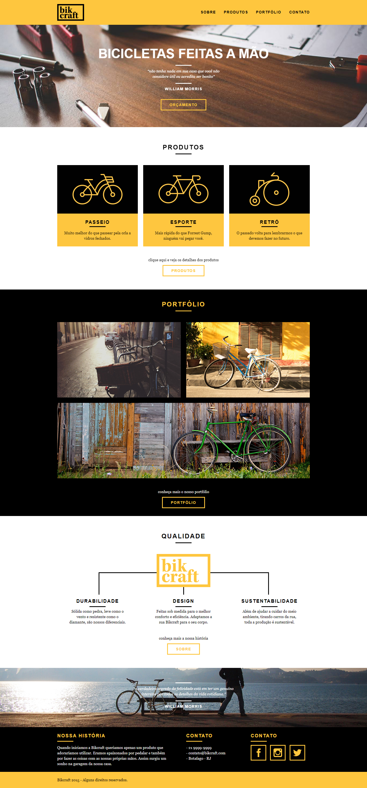

<h1 align="center">
  BikCraft
</h1>

<!-- Badges -->

  <!-- if your  -->
  

<!-- summary -->

  <a href="#clipboard-description">Description</a>&nbsp;&nbsp;&nbsp;|&nbsp;&nbsp;&nbsp;
  <a href="#rocket-technologies-and-resources">Technologies and resources</a>&nbsp;&nbsp;&nbsp;|&nbsp;&nbsp;&nbsp;
  <a href="#bulb-layout">Layout</a>&nbsp;&nbsp;&nbsp;|&nbsp;&nbsp;&nbsp;
  

## :clipboard: Description
Está procurando por biciletas feitas a mão? Bikcraft faz isso pra você!! Site intitucional de uma empresa que faz biclicletas sob medida. 😃

SIte produzido durante o curso de Web Design completo ofertado pela [Origamid](https://www.origamid.com/)

## :rocket: Technologies and resources

1. Download the repository

## :bulb: Layout

---

Build with 💙 By [Stefany Sá](https://twitter.com/stefany_vasc)

